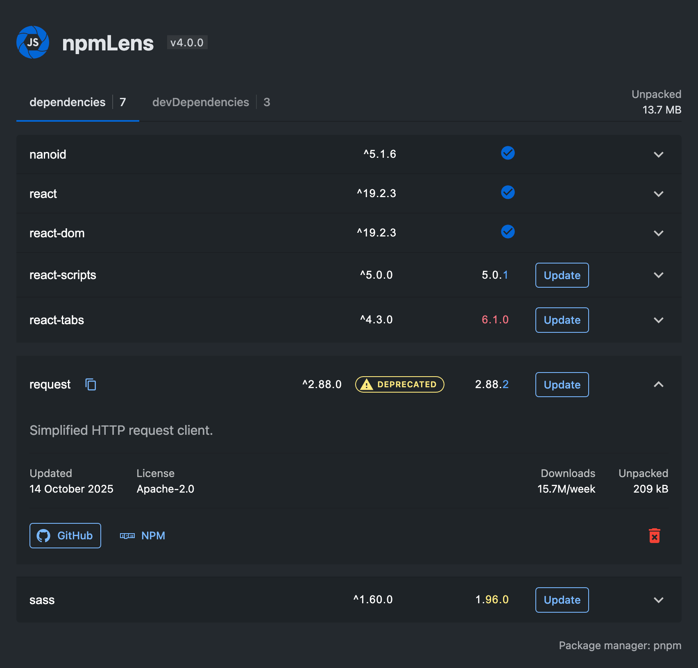

# npmLens

**A simple and elegant visual panel for managing npm dependencies in your project.** Monitor updates, analyze package sizes, and manage dependencies — all from a convenient sidebar.

## ✨ Features

- **Visual dependency list** — See all your dependencies and their versions at a glance
- **Update detection** — Check for new available versions with one click
- **Easy updates** — Update or remove packages directly from the panel
- **Multi-package queue** — Queue multiple package updates simultaneously
- **Deprecated warnings** — Get notified when using deprecated packages
- **Package info** — View basic information about any package
- **Size analysis** — Calculate the total size impact of your dependencies
- **Download statistics** — View weekly download counts with sparkline charts
- **Theme aware** — Adapts seamlessly to your VS Code theme

## 📥 Installation

### From VS Code Marketplace

1. Open **Extensions** sidebar in VS Code (`Ctrl+Shift+X` / `Cmd+Shift+X`)
2. Search for **npmLens**
3. Click **Install**

### From VSIX

1. Download the `.vsix` file from [Releases](https://github.com/Pilaton/vscode-npm-lens/releases)
2. Run `code --install-extension vscode-npm-lens-x.x.x.vsix`

## 🚀 Usage

1. Open a project with a `package.json` file
2. Click the **npmLens** icon in the Activity Bar (sidebar)
3. Explore your dependencies!

## 🔧 Requirements

- VS Code `>=1.106.0`
- Node.js `>=20.0.0`
- A `package.json` file in your workspace

## 🤝 Contributing

Contributions are welcome! Please read our [Contributing Guide](CONTRIBUTING.md) for details on how to get started.

## 📝 Changelog

See [CHANGELOG.md](CHANGELOG.md) for a list of changes.

## 📄 License

This project is licensed under the MIT License — see the [LICENSE](LICENSE) file for details.

## 🔗 Links

- [VS Code Marketplace](https://marketplace.visualstudio.com/items?itemName=Pilaton.vscode-npm-lens)
- [GitHub Repository](https://github.com/Pilaton/vscode-npm-lens)
- [Report an Issue](https://github.com/Pilaton/vscode-npm-lens/issues)
